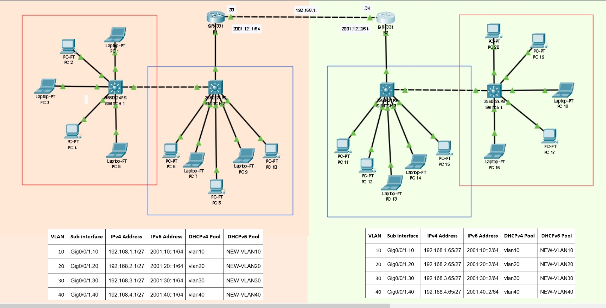

# 🌐 Dual Stack Enterprise Network Project (IPv4 + IPv6)

This project simulates an **enterprise-level dual-stack network** using Cisco Packet Tracer, with full **VLAN segmentation**, **router-on-a-stick inter-VLAN routing**, **DHCPv4 & DHCPv6**, and a mix of **IPv4 static routing** and **IPv6 dynamic routing using OSPFv3**.

> 🚀 Designed and implemented as part of my CCNA hands-on practice and portfolio development.

---

## 📌 Project Objectives

- Implement **VLANs** to segment departments (HR, IT, Finance, Admin)
- Configure **802.1Q trunk ports** between routers and switches
- Use **subinterfaces** on routers to perform inter-VLAN routing
- Enable **static routing for IPv4** and **OSPF for IPv6**
- Setup **DHCPv4 and DHCPv6 servers** on routers
- Ensure full **IPv4 and IPv6 communication** between devices in different VLANs

---

## 📐 Topology Summary

- **2 Routers:** R1 and R2 (dual-stack configured)
- **4 Switches:** SW1 to SW4
- **4 VLANs:** VLAN 10 (HR), VLAN 20 (IT), VLAN 30 (Finance), VLAN 40 (Admin)
- **Multiple PCs** assigned to VLANs across all switches
- **Trunk ports** used to connect routers and switches

---

## 🧠 Technologies Used

| Technology     | Configuration                        |
|----------------|--------------------------------------|
| VLANs          | VLAN 10, 20, 30, 40 on SW1–SW4       |
| Trunk Ports    | Fa0/24, Gi0/1, Fa0/23 (where needed) |
| Subinterfaces  | Router-on-a-stick using G0/0/1.x     |
| Static Routing | For IPv4                             |
| OSPFv3         | For IPv6 dynamic routing             |
| DHCPv4         | Pool per VLAN with exclusions        |
| DHCPv6         | Prefix-based pools with DNS config   |
| IPv6 Routing   | `ipv6 unicast-routing` + OSPF area 0 |

---

## 🧾 IP Addressing Scheme

### 🔹 Router 1 (R1) Subinterfaces

| VLAN | Interface     | IPv4 Address       | IPv6 Address       | Purpose |
|------|---------------|--------------------|---------------------|---------|
| 10   | G0/0/1.10     | 192.168.1.1/27     | 2001:10::1/64       | HR      |
| 20   | G0/0/1.20     | 192.168.2.1/27     | 2001:20::1/64       | IT      |
| 30   | G0/0/1.30     | 192.168.3.1/27     | 2001:30::1/64       | Finance |
| 40   | G0/0/1.40     | 192.168.4.1/27     | 2001:40::1/64       | Admin   |

### 🔹 Router 2 (R2) Subinterfaces

| VLAN | Interface     | IPv4 Address       | IPv6 Address       | Purpose |
|------|---------------|--------------------|---------------------|---------|
| 10   | G0/0/1.10     | 192.168.1.65/27    | 2001:10::2/64       | HR      |
| 20   | G0/0/1.20     | 192.168.2.65/27    | 2001:20::2/64       | IT      |
| 30   | G0/0/1.30     | 192.168.3.65/27    | 2001:30::2/64       | Finance |
| 40   | G0/0/1.40     | 192.168.4.65/27    | 2001:40::2/64       | Admin   |

---

### 🖼️ Network Topology

---

## 📥 DHCP Server Setup

### ✅ On R1 and R2:

- **DHCPv4 Pools**: Separate pools for each VLAN with excluded addresses
- **DHCPv6 Pools**: Prefix delegation using `ipv6 dhcp pool` with lifetime and DNS

---

## 💼 Skills Demonstrated

- VLAN and trunking on multi-switch architecture
- Router-on-a-stick inter-VLAN routing
- IPv4 Static + IPv6 Dynamic (OSPFv3) Routing
- DHCP configuration for dual stack networks
- Hands-on Packet Tracer design and verification
- Professional documentation (README + Excel)

---

## 🙋‍♂️ Author

**Sadiq**  
📌 Network Engineer | CCNA Certified | Aspiring Cloud & Security Architect  

🔗 [LinkedIn Profile](linkedin.com/in/iam-sadiq)  
📂 [GitHub Portfolio](https://github.com/Sadiq-CA)  
✉️ Email: Iam_sadiq.s@yahoo.com

---

